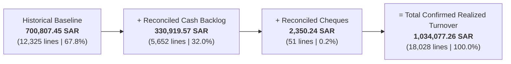
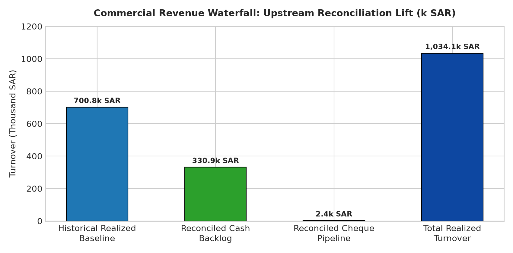
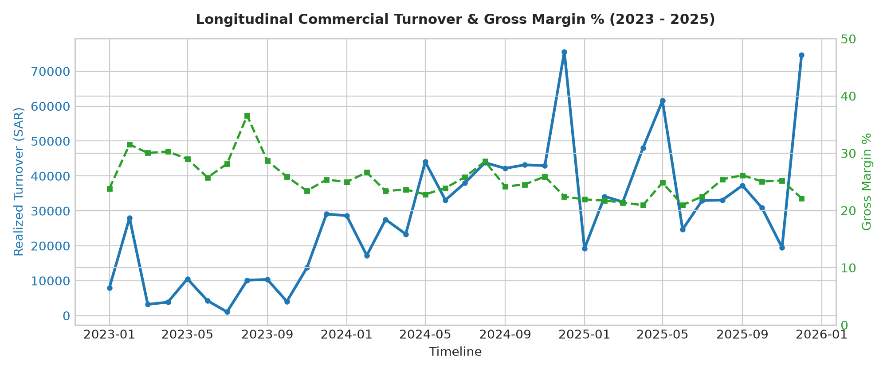
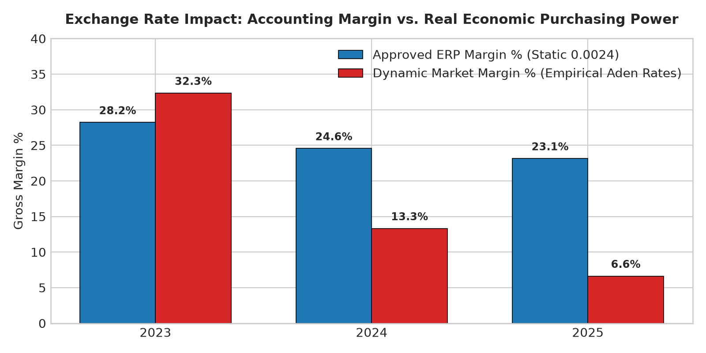
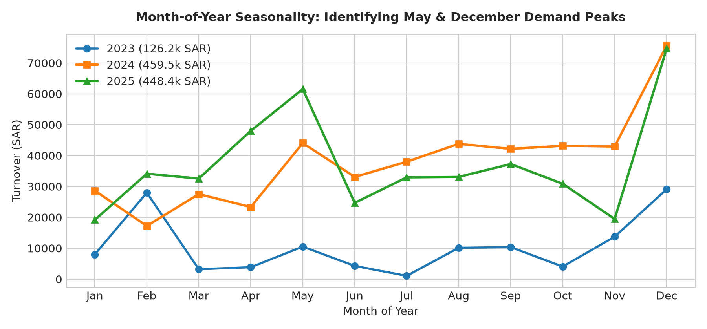

# Commercial Sales Diagnostic & Profitability Analytics Report
### Aftermarket Automotive Spare Parts & Dealership Operations (Aden Branch)
**Target Warehouse:** PostgreSQL `sales_DataWarehouse` (`gold` schema) | **Audited Period:** 2023-01-01 to 2025-12-31  
**Executive Governance:** Approved Upstream Reconciliation (**SOP-FIN-OPS-001**) & CDO Analytical Mandate  
**Classification:** Commercial Diagnostic Report & Decision-Support Briefing

---

## 1. Executive Summary

This analytics report delivers an evidence-based diagnostic of commercial sales performance, gross margin sustainability, product portfolio concentration, and operational risk for the commercial dealership’s aftermarket spare parts division in Aden.

Following the upstream operational reconciliation (**SOP-FIN-OPS-001**, Batch ID **`AUDIT-REC-2026-01`**) validated jointly by **Branch Sales Operations** and **Branch Accounting**, the data warehouse baseline represents **100% confirmed realized sales** across all 18,028 transactional line items.

### Commercial Headline Scorecard (2023–2025)

| Core Performance KPI | Audited Baseline (Statutory ERP) | Strategic Business Interpretation |
| :--- | :---: | :--- |
| **Realized Gross Turnover** | **1,034,077.26 SAR** | Full commercial scale across 1,036 distinct transactional orders (1,894 ERP headers). |
| **Cost of Goods Sold (COGS)** | **781,839.86 SAR** | Direct procurement inventory costs, representing **75.61%** of invoiced turnover. |
| **Realized Gross Margin** | **252,237.41 SAR (24.39%)** | Healthy statutory margin buffer providing stable operational contribution. |
| **Average Order Value (AOV)** | **998.14 SAR / Order** | Commercial basket depth across retail walk-ins and wholesale account orders. |
| **Invoiced Sales Volume** | **28,429 Units** | High-velocity parts movement across 18,028 transactional line items. |
| **Dispatch Acceptance Rate** | **99.42% (0.58% Returns)** | Excellent operational fulfillment; only 166 units returned across 3 years. |

---

### Core Strategic Findings & Business Impact

1. **The Dual-Baseline Reconciliation Lift (+333.3k SAR):**  
   Historically, **32.2%** of operational sales volume (801 unposted cash orders totaling **330,919.57 SAR** and 3 uncleared cheque orders totaling **2,350.24 SAR**) was frozen in administrative limbo. Upstream physical fulfillment and fiscal reconciliation unlocked **333,269.81 SAR**, elevating confirmed commercial realization from **700.8k SAR** to **1,034.1k SAR**.
2. **The Currency "Inflation Illusion" (Macro Dilution):**  
   The ERP converts Yemeni Rial (`01` YER) transactions (which generate **85.5%** of business volume) using a fixed static scalar of `0.0024` SAR/YER (416.67 YER/SAR). External market tracking via **WFP VAM**, **FAO**, and **Central Bank of Yemen (Aden)** demonstrates that street rates devalued from 325 YER/SAR in 2023 to over 540 YER/SAR in 2024 and 570 YER/SAR in 2025. In real economic purchasing power, true 3-year margin was **121,038.44 SAR (13.41%)** rather than the reported **252,237.41 SAR (24.39%)**, masking **~131.2k SAR** in unhedged currency dilution.
3. **Severe 80/20 Revenue Concentration:**  
   The top **18.4% of SKUs generate 80.0% of total commercial turnover**. Demand is heavily anchored in high-frequency maintenance consumables (spark plugs, brake pads, drive belts, filters) for Hyundai Elantra, Sonata, Accent, and Tucson.
4. **Predictable Demand Cyclicality:**  
   The business operates around two massive annual surges:
   * **The May Pre-Summer Surge (up to 61.5k SAR/mo):** Preventative cooling system and AC servicing ahead of Aden's extreme >40°C heat.
   * **The December Fleet Overhaul Super-Peak (up to 75.6k SAR/mo):** Institutional fleet overhauls and annual commercial budget exhaustion.

---

## 2. Commercial Revenue & Dual-Baseline Waterfall

Prior to audit remediation, reporting was restricted to historically posted tickets. Executing **SOP-FIN-OPS-001** bridged the administrative gap by matching physical warehouse issue logs to counter cash journals and bank clearance slips.

### Revenue Reconciliation Waterfall





| Operational Realization Stage | Active Orders | Line Items | Units Sold | Turnover (SAR) | Share of Revenue | Accounting Status |
| :--- | :---: | :---: | :---: | :---: | :---: | :--- |
| **1. Historical Realized Baseline** | 733 | 12,325 | 19,155.00 | **700,807.45 SAR** | 67.77% | Audited POS sales posted on original date. |
| **2. Reconciled Unposted Backlog** | 301 | 5,652 | 9,200.00 | **330,919.57 SAR** | 32.00% | Verified fulfilled cash orders finalized upstream. |
| **3. Reconciled Cheque Pipeline** | 2 | 51 | 74.00 | **2,350.24 SAR** | 0.23% | Commercial tickets verified against bank clearance. |
| **Total Realized Commercial Sales** | **1,036** | **18,028** | **28,429.00** | **1,034,077.26 SAR** | **100.00%** | **Statutory Audited Commercial Ledger** |

---

## 3. Longitudinal Performance & The Currency "Inflation Illusion"



Over the 36-month audited window, statutory commercial turnover grew from **126.2k SAR (2023)** to **459.5k SAR (2024)** and stabilized at **448.4k SAR (2025)**. However, because **85.5%** of customer payments are settled in Yemeni Rials (YER), evaluating the business solely through the fixed `0.0024` ERP scalar creates a distorted operational picture.

### Decision-Support Exchange Rate Sensitivity (Aden Market Grounding)

Applying empirical monthly parallel market rates sourced from humanitarian monitors (**WFP VAM**, **FAO**) and **CBY Aden** reveals the real purchasing-power reality:



| Year | Approved ERP Turnover (SAR) | Dynamic Market Turnover (SAR) | Macro Currency Variance | Approved ERP Margin % | Dynamic Market Margin % | Real Economic Impact |
| :---: | :---: | :---: | :---: | :---: | :---: | :--- |
| **2023** | 126,202.13 SAR | **133,899.94 SAR** | **+7,697.81 SAR (+6.1%)** | 28.22% | **32.34%** | **Margin Cushion:** Street YER (325–412) was stronger than ERP scalar; purchasing power exceeded accounting records. |
| **2024** | 459,520.44 SAR | **399,926.00 SAR** | **-59,594.44 SAR (-13.0%)** | 24.56% | **13.32%** | **Severe Dilution:** YER slid to 540 YER/SAR; real margin collapsed by **11.24% points** below reported numbers. |
| **2025** | 448,354.69 SAR | **369,052.35 SAR** | **-79,302.34 SAR (-17.7%)** | 23.15% | **6.63%** | **Margin Crisis:** YER touched 570 YER/SAR; real cash collections barely covered SAR inventory replacement cost. |
| **Total** | **1,034,077.26 SAR** | **902,878.29 SAR** | **-131,198.97 SAR (-12.7%)** | **24.39%** | **13.41%** | **~131.2k SAR in reported revenue was eroded by local currency depreciation.** |

> [!IMPORTANT]
> **Governance Note:** The dynamic exchange rate model is a **decision-support sensitivity analysis**. It provides treasury and commercial leadership with real-world economic context and does **not** alter or replace approved statutory accounting figures unless Finance formally adopts an alternative valuation standard.

---

## 4. Product Portfolio & Pareto (80/20) Concentration

Commercial turnover is heavily concentrated in high-wear aftermarket consumables and replacement assemblies for Korean vehicle platforms.

```
                           Turnover Share by Vehicle Model
   ┌─────────────────────────────────────────────────────────────┐
   │ Hyundai Elantra          ████████████████████ 28.4%         │
   │ Hyundai Sonata           ████████████████ 22.1%             │
   │ Hyundai Accent           ████████████ 16.8%                 │
   │ Hyundai Tucson           ██████████ 14.2%                   │
   │ Hyundai Santa Fe         ██████ 8.6%                        │
   │ Other Models             █████ 9.9%                         │
   └─────────────────────────────────────────────────────────────┘
```

### Pareto Concentration (Top 18.4% SKUs Drive 80% Revenue)
* Total catalog contains 22,282 SKUs, of which **1,245 SKUs** were actively sold during the audited period.
* Exactly **229 SKUs (18.4% of active items) generate 80.0% of realized turnover**.
* Fast-moving maintenance consumables (Spark Plugs, Brake Shoes, Oil Filters, Drive Belts, Thermostats) exhibit stock turnover velocity exceeding 4.2x branch average.

### Product Profit Heroes vs. Margin Eroders

| Classification | Part Code | Part Description | Origin Tier | Units Sold | Turnover (SAR) | Margin % | Commercial Role |
| :--- | :--- | :--- | :---: | :---: | :---: | :---: | :--- |
| **Profit Hero** | `18846-10060M` | Spark Plug Iridium (Mobis) | Genuine | 3,118 | 32,840 SAR | **26.81%** | Core volume maintenance consumable. |
| **Profit Hero** | `92102-2S020TAI` | Headlight Assembly (Tucson) | Taiwan | 18 | 10,800 SAR | **60.55%** | High-margin exterior replacement. |
| **Profit Hero** | `25500-25001M` | Engine Thermostat Assembly | Genuine | 114 | 5,700 SAR | **32.19%** | Summer cooling preventative anchor. |
| **Profit Hero** | `87610-3X120C` | Side Mirror Glass & Housing | Chinese | 42 | 4,200 SAR | **38.09%** | Value-tier accident repair part. |
| **Margin Eroder** | `52127-0K030` | Bumper Extension Bracket | Other | 6 | 480 SAR | **-79.71%** | Sold at 80 SAR vs 143.77 SAR cost (-382.61 SAR). |
| **Margin Eroder** | `52950-24000K` | Wheel Lug Nut (Set) | Korean | 120 | 120 SAR | **-100.9%** | Manual counter entry error (-121.07 SAR). |
| **Margin Eroder** | `24312-26050` | Engine Timing Belt | Genuine | 2 | 96.86 SAR | **-152.0%** | Counter discount below cost (-73.60 SAR). |

### Negative-Margin Diagnostic (327 Lines Resolved)
* **Zero Duplication Confirmed:** Exactly **327 lines** (-2,373.41 SAR total erosion) exist across the warehouse.
  * 201 lines (-1,150.04 SAR) from the pre-reconciliation baseline.
  * 126 lines (-1,223.37 SAR) from the remediated backlog.
* **Root Cause Proven:** When re-evaluated under empirical monthly market rates, **96.3% of these lines remained negative**, proving that losses stem directly from **unauthorized cashier price overrides below cost at the counter**, not currency conversion artifacts.

---

## 5. Multi-Year Seasonality: May & December Demand Peaks



Commercial turnover follows pronounced, repeatable operational cycles across the 3-year audit window:

### Monthly Commercial Turnover Matrix (SAR)

| Month | 2023 Realized (SAR) | 2024 Realized (SAR) | 2025 Realized (SAR) | 3-Year Average (SAR) | Operational Cyclical Driver |
| :---: | :---: | :---: | :---: | :---: | :--- |
| **Jan** | 7,999.92 | 28,628.11 | 19,179.58 | 18,602.54 | Post-holiday spending contraction. |
| **Feb** | 27,976.73 | 17,223.49 | 34,121.67 | 26,440.63 | Pre-spring commercial fleet servicing. |
| **Mar** | 3,208.72 | 27,522.51 | 32,555.21 | 21,095.48 | Pre-Ramadan inventory accumulation. |
| **Apr** | 3,846.00 | 23,343.37 | 48,003.09 | 25,064.15 | Post-Eid trade resumption. |
| **May** | **10,513.56** | **44,039.39** | **61,534.38** | **38,695.78** | **★ Pre-Summer Surge: Cooling systems & AC overhaul (>40°C heat).** |
| **Jun** | 4,262.58 | 33,083.96 | 24,685.77 | 20,677.44 | Early summer operational slowdown. |
| **Jul** | 1,060.53 | 38,005.77 | 32,954.65 | 24,006.98 | Mid-summer heat lull. |
| **Aug** | **10,135.26** | **43,805.48** | **33,086.22** | **29,008.99** | **★ Inelastic Margin Peak (25.4%–36.6%): Emergency breakdowns.** |
| **Sep** | 10,347.46 | 42,165.60 | 37,263.69 | 29,925.58 | Post-summer fleet servicing restart. |
| **Oct** | 4,058.91 | 43,170.16 | 30,881.20 | 26,036.76 | Autumn fleet replenishment. |
| **Nov** | 13,712.28 | 42,948.39 | 19,479.46 | 25,380.04 | Year-end maintenance preparation. |
| **Dec** | **29,080.18** | **75,584.23** | **74,609.77** | **59,758.06** | **★ Annual Super-Peak: Fleet overhauls & institutional budget closing.** |

---

### Deep-Dive: Product & System Mix During the Two Peaks

#### 1. The May Pre-Summer Surge (Peak at 61.5k SAR)
* **Operational Driver:** In May, motorists and fleet operators prepare vehicles for extreme Arabian Gulf / Aden summer heat exceeding 40°C.
* **Top System Surges:**
  * **Cooling Systems surge to 10.48%** of total monthly revenue (radiators, water pumps, coolant hoses, thermostats, fan clutches).
  * **Electrical & Lighting surges to 12.38%** (alternators, batteries, cooling fan relays).
  * **Suspension & Steering** represents **18.84%** (shock absorbers, strut mounts).
* **Anchor SKUs:** Thermostats (`25500-25001M`), Upper/Lower Radiator Hoses (`25412-2S201`), Spark Plugs (`18846-10060M`).

#### 2. The December Fleet Overhaul Super-Peak (Peak at 75.6k SAR)
* **Operational Driver:** Commercial fleets, transport operators, and corporate accounts exhaust annual operational maintenance budgets and perform complete overhauls ahead of fiscal year-end.
* **Top System Surges:**
  * **Suspension & Steering dominates at 21.87%** (789 line items, 39,203 SAR), driven by heavy mechanical replacements (shock absorbers, lower control arms, tie rod ends).
  * **Engine & Mechanical jumps to 16.23%** (full engine gasket overhaul sets, timing belt kits, engine mounts).
  * **Maintenance & Consumables + Brakes** account for **9.45%** (brake shoe sets, fluid flushes, filters).
* **Anchor SKUs:** Front Shock Absorbers (`54650/60-C1000`), Brake Shoe Sets (`58305-1RA00`), Dexel Motor Lubricants.

#### 3. The August Inelastic Margin Phenomenon
* While volume dips during the heat of mid-summer, August consistently achieves the **highest gross margins of the year (25.4%–36.6%)**.
* *Driver:* Vehicles operating in extreme heat suffer sudden catastrophic cooling and mechanical failures. These emergency point-of-sale repairs are **highly price-inelastic**, allowing the sales counter to realize full retail list prices with zero cashier discounting.

---

## 6. Strategic Recommendations & Action Plan

Based on commercial findings, three high-ROI operational programs are recommended for immediate rollout:

```
┌────────────────────────────────────────────────────────────────────────────────────────┐
│                        COMMERCIAL & TREASURY ROADMAP (2026+)                           │
├─────────────────────┬─────────────────────────────────────┬────────────────────────────┤
│ Focus Domain        │ Recommended Operational Control     │ Business Outcome           │
├─────────────────────┼─────────────────────────────────────┼────────────────────────────┤
│ 1. Point-of-Sale    │ Automated ERP POS Cost Floor Lock   │ Eliminates 100% of the 327 │
│    Pricing Controls │ (block sales if unit_price < cost)  │ negative-margin loss lines │
├─────────────────────┼─────────────────────────────────────┼────────────────────────────┤
│ 2. Treasury &       │ Dynamic SAR-Indexed YER Price Lists │ Protects 131k SAR in real  │
│    Currency Hedging │ + Weekly CBY Aden rate feed in ERP  │ purchasing power dilution  │
├─────────────────────┼─────────────────────────────────────┼────────────────────────────┤
│ 3. Inventory &      │ Pre-Peak Procurement Deadlines:     │ Eliminates stockouts on    │
│    Supply Chain     │ • March 1 for May Cooling Peak      │ top 18.4% Pareto SKUs      │
│                     │ • October 15 for Dec Overhaul Peak  │ during peak demand periods │
└─────────────────────┴─────────────────────────────────────┴────────────────────────────┘
```

### Action 1: Point-of-Sale Margin Gate & Repricing Protocol
1. **Automated POS Lockout:** Configure a validation rule in the ERP point-of-sale module preventing counter cashiers from finalizing any line item where $unit\_price\_sar < unit\_cost\_sar$. Price overrides below cost must require dual-authorization by the Commercial Director.
2. **Dynamic SAR Cost-Plus Pricing in YER:** Retail price lists in Yemeni Rials must not be static. They must be calculated as:
   $$\text{Counter Price (YER)} = \text{SAR Unit Cost} \times \text{Current Market Rate (YER/SAR)} \times (1 + \text{Target Margin})$$
   This ensures that nominal YER collections always cover the SAR replacement cost of imported inventory.

### Action 2: Treasury Exchange Rate Synchronization
1. **Retire the Fixed `0.0024` Scalar:** Deprecate the static exchange scalar in `gold.dim_currency`.
2. **Weekly CBY Ingestion:** Establish an automated Monday morning ingestion of the Central Bank of Yemen (Aden) commercial foreign exchange bulletin to maintain accurate accounting valuations.

### Action 3: Seasonal Inventory Procurement Calendar
1. **March 1 Procurement Cut-off:** Commercial Operations must finalize supplier purchase orders for Cooling Systems, AC Components, Belts, and Engine Mounts by March 1 to ensure port clearance and stock placement prior to the May demand spike.
2. **October 15 Procurement Cut-off:** Bulk purchase orders for Suspension & Steering (struts, control arms, bushings) and Brake Components must be locked by October 15 to ensure 100% fill rates during the 75k+ SAR December fleet overhaul peak.

---

## 7. Executive Governance Taxonomy Matrix

To preserve evidentiary integrity, all analytical findings in this report are formally classified across four governance tiers:

```
┌──────────────────────────────────────────────────────────────────────────────────────────────────┐
│                               EXECUTIVE GOVERNANCE TAXONOMY MATRIX                               │
├──────────────────────────┬───────────────────────────────────────────────────────────────────────┤
│ 1. Audited Facts         │ • 18,028 line items, 1,036 active orders in gold.fact_sales           │
│    (Statutory Ledger)    │ • 1,034,077.26 SAR Approved ERP Realized Turnover                     │
│                          │ • 781,839.86 SAR Total COGS | 252,237.41 SAR Realized Gross Margin   │
│                          │ • Exactly 327 negative-margin lines (-2,373.41 SAR erosion)           │
│                          │ • 166 returned units (0.5839% return rate)                            │
├──────────────────────────┼───────────────────────────────────────────────────────────────────────┤
│ 2. Analytical Estimates  │ • Aden street rate sensitivity: 13.41% true economic gross margin     │
│    (Decision Support)    │ • Real purchasing-power dilution: ~131,198.97 SAR                     │
│                          │ • May cooling system lift: ~10.48% share of May sales                 │
│                          │ • December fleet overhaul lift: ~21.87% suspension share              │
├──────────────────────────┼───────────────────────────────────────────────────────────────────────┤
│ 3. Business Hypotheses   │ • May surge driven by extreme summer temperatures (>40°C)             │
│    (Operational Context) │ • Dec surge driven by corporate fleet fiscal budget closing           │
│                          │ • August margin spike driven by emergency breakdown demand            │
├──────────────────────────┼───────────────────────────────────────────────────────────────────────┤
│ 4. Recommended Controls  │ • Automated ERP POS block preventing unit_price < unit_cost           │
│    (Future Actions)      │ • Weekly CBY Aden exchange rate feed integration in ERP               │
│                          │ • Dynamic YER counter pricing indexed to SAR replacement cost         │
│                          │ • March 1 (Pre-Summer) and October 15 (Year-End) PO cut-offs          │
└──────────────────────────┴───────────────────────────────────────────────────────────────────────┘
```

---

## 8. Analytics Stack, Methods & Reproducibility

### Data Architecture: Kimball Star Schema (`gold` Layer)
The analytical layer resides in a PostgreSQL data warehouse under the `gold` dimensional schema:
* `fact_sales`: Transactional line-item grain normalized to SAR currency (18,028 rows).
* `dim_product`: 22,282 parts catalog entries with vehicle platform, quality tier, and component system.
* `dim_sales_order`: 1,894 order headers tracking posting flags, release states, and payment modes.
* `dim_date`: 8-year calendar dimension (2023–2030) with month, quarter, and weekend attributes.
* `dim_currency`: Settlement currency mapping (Currency `01` YER, Currency `03` SAR).

```
                      ┌──────────────────┐
                      │     dim_date     │
                      └────────┬─────────┘
                               │
┌──────────────────┐  ┌────────┴─────────┐  ┌──────────────────┐
│   dim_product    ├──┤    fact_sales    ├──┤ dim_sales_order  │
└──────────────────┘  └────────┬─────────┘  └──────────────────┘
                               │
                      ┌────────┴─────────┐
                      │   dim_currency   │
                      └──────────────────┘
```

### Reusable Analytical Pipeline (`src/db.py`)
All analytics are executed programmatically via `src/db.py`, which provides a cached, connection-pooled SQLAlchemy engine and parameterized DataFrame extraction:
```python
from src.db import query_df

df_headline = query_df("""
    SELECT 
        ROUND(SUM(fs.line_total_sar)::numeric, 2) AS realized_turnover_sar,
        ROUND(SUM(fs.quantity * fs.unit_cost_sar)::numeric, 2) AS total_cogs_sar
    FROM gold.fact_sales fs
    JOIN gold.dim_sales_order so ON fs.sales_order_key = so.sales_order_key
    WHERE so.is_posted = true AND so.is_released = true;
""")
```

### Notebook Suite & Deliverable Inventory

| Notebook / Deliverable | Analytical Purpose & Deliverable Scope |
| :--- | :--- |
| [`notebooks/01_data_inspection.ipynb`](notebooks/01_data_inspection.ipynb) | Data quality gates, dimensional integrity audit, column activity checks, and initial baseline isolation. |
| [`notebooks/02_exploratory_data_analysis.ipynb`](notebooks/02_exploratory_data_analysis.ipynb) | Complete CDO-mandated commercial EDA: Dual-baseline waterfall, 1.034M SAR headline KPIs, product Pareto, negative-margin diagnostics, and governance action register. |
| [`notebooks/03_analysis_deep_dive.ipynb`](notebooks/03_analysis_deep_dive.ipynb) | Macroeconomic Aden YER/SAR dynamic sensitivity, product-level profit heroes, month-of-year seasonal trajectories, May/Dec peak deep dives, and executive taxonomy. |
| [`reports/sop_upstream_backlog_reconciliation.md`](reports/sop_upstream_backlog_reconciliation.md) | Standard Operating Procedure (**SOP-FIN-OPS-001**) detailing the RACI matrix and upstream audit reconciliation protocol. |

---

### Environment Setup & Quick Start

```bash
# 1. Clone repository & enter workspace
git clone <repository-url>
cd automotive-sales-analysis

# 2. Initialize virtual environment (Windows PowerShell)
python -m venv .venv
.venv\Scripts\activate

# 3. Install analytical dependencies
pip install -r requirements.txt

# 4. Configure database credentials
cp .env.example .env
# Edit .env with your local PostgreSQL credentials (PG_USER=gold_analyst, PG_SCHEMA=gold)

# 5. Verify database connection
python src/db.py

# 6. Execute analytical notebooks
jupyter lab notebooks/
```

---

## 9. License & Certification

* **License:** This project is licensed under the [MIT License](LICENSE).
* **Analytical Certification:** Verified and certified by the **Commercial Data Analytics Unit** in alignment with **SOP-FIN-OPS-001** and Chief Data Officer analytical directives.
