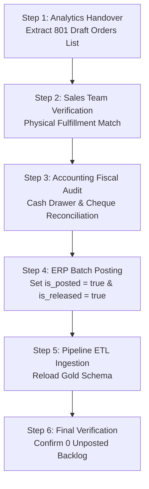

# Standard Operating Procedure (SOP): Upstream Order Backlog Remediation

**Document Code:** SOP-FIN-OPS-001  
**Target Process:** Upstream Reconciled Order Finalization & ERP Batch Posting  
**Scope:** Commercial Dealership – Spare Parts & Service Division  
**Data Domain:** PostgreSQL `sales_DataWarehouse` (`gold` schema)  
**Effective Date:** 2026-09-26  

---

## 1. Purpose & Policy Statement

This Standard Operating Procedure establishes the governance protocol for reconciling and posting **801 draft/unposted sales orders** (totaling **333,269.81 SAR** across 5,703 line items) currently residing in an unposted (`is_posted = false`) or unreleased (`is_released = false`) state in the upstream ERP.

### Core Policy Rule
> **Separation of Duties & Source Integrity:**  
> The Data Analytics layer does not fabricate, override, or alter operational transaction statuses downstream.  
> Commercial and fiscal finalization must originate directly in the upstream operational system (ERP) through joint validation by the **Sales** and **Accounting** departments.

---

## 2. Roles & Responsibilities (RACI Matrix)

| Operational Role | Department | RACI | Specific Responsibility |
|:---|:---|:---:|:---|
| **Counter Sales Lead** | Branch Operations | **Responsible (R)** | Physically verify fulfillment of counter tickets against warehouse issue logs and counter receipts. |
| **Branch Accountant** | Finance & Accounts | **Accountable (A)** | Match tickets to cash drawer records and bank settlement slips; execute administrative batch posting in ERP. |
| **Analytics Engineer** | Business Intelligence | **Consulted (C)** | Provide the evidentiary backlog audit extraction list; validate ETL pipeline ingestion post-posting. |
| **Commercial Director** | Executive Leadership | **Informed (I)** | Review monthly realized baseline adjustments and sign off on backlog closure. |

---

## 3. Step-by-Step Upstream Reconciliation Workflow



### Step 1: Handover List Extraction (Analytics)
The Analytics team generates the master reconciliation schedule filtering:
```sql
SELECT 
    so.sales_order_key,
    so.invoice_type,
    so.payment_mode,
    so.is_cheque,
    COUNT(f.fact_sales_key) AS line_items,
    SUM(f.line_total_sar) AS total_order_sar
FROM gold.dim_sales_order so
JOIN gold.fact_sales f ON so.sales_order_key = f.sales_order_key
WHERE so.is_posted = false OR so.is_released = false
GROUP BY so.sales_order_key, so.invoice_type, so.payment_mode, so.is_cheque
ORDER BY total_order_sar DESC;
```

### Step 2: Physical Fulfillment Verification (Sales Counter)
For each order in the schedule:
1. Confirm inventory was physically dispensed to the customer.
2. Confirm the printed counter ticket matches the ERP document reference.
3. If an order was cancelled, duplicate, or abandoned, flag it as **"VOID"**.

### Step 3: Fiscal Reconciliation & Posting Execution (Accounting)
For all verified sales:
1. **Cash Invoices (Invoice Types `06`, `04`, `26`)**:
   - Reconcile collected amounts against daily cash journal summaries.
   - Execute the official **"Post"** and **"Release"** action in the ERP module.
2. **Cheque Invoices (Invoice Type `06`, Cheque = `true`)**:
   - Confirm bank clearance slip before releasing.
3. **Void Orders**:
   - Execute formal document cancellation in the ERP to return unfulfilled stock to available warehouse inventory.

### Step 4: Upstream Pipeline Synchronization (Data Engineering)
1. Run the upstream ETL sync to extract updated transaction headers into Bronze and Silver layers.
2. Rebuild `gold.dim_sales_order` and `gold.fact_sales`.
3. Verify that `is_posted` and `is_released` flags evaluate to `true` for all finalized records.

---

## 4. End-of-Day (EOD) Prevention Protocol (Recurring SOP)

To prevent future backlog accumulation at the branch point of sale:

1. **Daily POS Cut-off Check**:  
   At 19:30 daily, the cashier must execute the ERP *Unposted Order Exception Report*.
2. **Register Closure Lockout**:  
   No cash register shift can be closed while draft sales tickets remain open in the system.
3. **Automated Overnight Batching (Recommended ERP Enhancement)**:  
   Configure the ERP to execute an automatic nightly post for fully paid cash counter tickets that have passed physical dispatch.

---

## 5. Audit Trail & Compliance Documentation

Upon completion of the upstream posting:
1. Accounting and Sales leads co-sign the **Backlog Reconciliation Sign-off Certificate**.
2. Analytics archives the certificate alongside the updated warehouse baseline in `reports/`.
3. The baseline realization reporting filter is updated to reflect 100% posted commercial operations.
